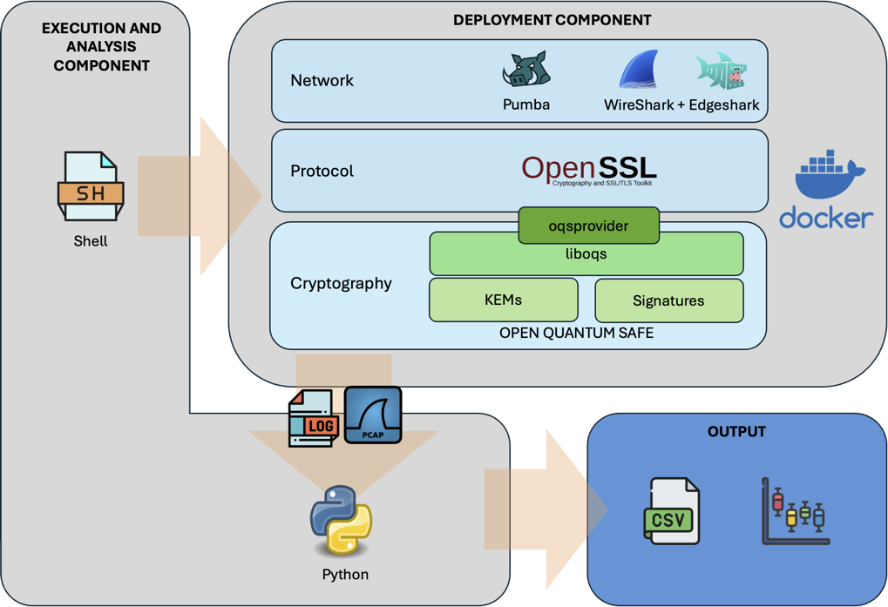

# 🐳 PQ-TLS Docker Framework


This framework provides a complete environment to test and benchmark the TLS protocol using classical, hybrid, and post-quantum Key Encapsulation Mechanisms (KEMs) and signature cryptographic primitives inside Docker containers. Figure 1 illustrates the components of the framework.

It supports multiple experimental scenarios, including network delays, packet loss, and comparisons of cryptographic algorithms.

<p align="center"> <br>
  <em>Figure 1. Performance Evaluation Framework.</em>

</p>


---

## ⚙️ Requirements

- Docker installed and running
- Bash shell (Linux/macOS compatible)
- Wireshark (optional, for packet capture)

---

## 🚀 Getting Started

Launch the main interface:

```bash
./frameWork.sh
```

You will see the following menu:

```
╔════════════════════════════════════════╗
║      🐳  Docker & Protocol Menu        ║
╠════════════════════════════════════════╣
║ 1️⃣  Check installation                 ║
║ 2️⃣  Docker creation                    ║
║ 3️⃣  Running Scenario                   ║
║ 4️⃣  Exit                               ║
╚════════════════════════════════════════╝
```

---

## 📋 Menu Options

### 1️⃣ Check Installation

- Verifies Docker is installed and running.
- Downloads **Pumba** (if missing) to simulate network impairments.
- Checks for **Wireshark** availability.
- Creates required directories if not present.

### 2️⃣ Docker Creation

Presents a sub-menu for Docker image setup:

```
🐳 Docker Creation Options
1) Build Docker (with cache)
2) Build Docker (no cache)
3) Verify installation
4) Back to main menu
```

- **1)** Builds the Docker image using cache.
- **2)** Builds the Docker image from scratch (no cache).
- **3)** Verifies OpenSSL + liboqs + oqs-provider integration by launching a sample TLS handshake test.
- **4)** Returns to main menu.

### 3️⃣ Running Scenario

Runs one of the predefined test scenarios:

```
📂 Available Scenarios:
──────────────────────────────
 1) 1-KEM_Traditional-Hybrid-PQ
 2) 2-DELAYS
 3) 3-LOSS
 4) 4-Future
 5) 5-HQC
```

- **Scenario 1**: Compares handshake performance across classical, hybrid, and PQ KEMs in an ideal network.
- **Scenario 2**: Tests impact of increasing network **delay** (1ms, 2m, 5ms, 7ms, 10ms, 20ms, 50ms and 100ms).
- **Scenario 3**: Simulates varying **packet loss** conditions (0.1%, 0.2%, 0.3%, 0.5%, 0.7% and 1%).
- **Scenario 4**: Handshake with hybrid and post-quantum signature
- **Scenario 5**: Tests the HQC post-quantum primitive in multiple configurations.

Before running, the user is warned that existing logs in the selected scenario may be overwritten.

### 4️⃣ Exit

Cleanly exits the framework.

---

## 📊 Output

- Results and logs are stored under the `Time/` directory or its subfolders depending on the scenario.
- Supports additional processing and visualization through Python/Bash analysis scripts.

---

## 📁 Project Structure

```
.
├── Applications/          # Auxiliary tools like Pumba
├── DockerTLS-PQ           # Multistage Dockerfile 
├── Scenarios/             # Several predeterminates scenarios
	├──	Scripts				# Docker and Python scripts to launch and process each scenario
	├──	Logs					# Raw output from Docker executions 
	├──	Csvs					# Processed logs in CSV format 
	├──	Plots					# Graphical representation
├── Legacy/                # Previosly version of the framework
├── frameWork.sh           # Main launcher script (menu-based)
```

---

## 🔒 Cryptographic Setup

- Signature Algorithms (Traditional, Hybrid and  Post-Quantum): `ed25519`, `secp384r1`, `secp521r1`, `falcon`, `mldsa`, `sphincs`, `mayo`, `CROSS`
- KEMs: Classical (e.g., `x25519`), Hybrid (e.g., `p256_mlkem512`), and Post-Quantum (e.g., `mlkem512`, `mlkem768`, `mlkem1024`, `hqc`).
- OpenSSL (v 3.4) is compiled with [`liboqs (v0.12.0)`](https://github.com/open-quantum-safe/liboqs) and [`oqs-provider (v0.8.0)`](https://github.com/open-quantum-safe/oqs-provider).

---

## 📌 Notes

- The image is based on `ubuntu:24.10` and builds all dependencies from source.
- The build includes patched OpenSSL to support extended signature/KEM benchmarking.
- Compatible with both `x86_64` and `arm64` architectures.

---

